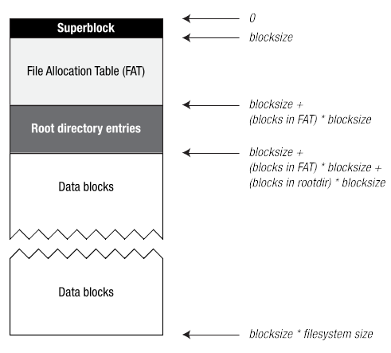

<a name="readme-top"></a>

<!-- Title -->
<div align="center">
<h3 align="center">File Allocation Table (FAT) File System</h3>

  <p align="center">
    A simple implementation of a FAT file system
  </p>
</div>


<!-- TABLE OF CONTENTS -->
<details>
  <summary>Table of Contents</summary>
  <ol>
    <li>
      <a href="#overview">Overview</a>
      <ul>
        <li><a href="#built-with">Built With</a></li>
      </ul>
    </li>
    <li>
      <a href="#design-solution">Design Solution</a>
      <ul>
        <li><a href="#task-1">statFATfs.c</a></li>
        <li><a href="#task-2">lsFATfs.c</a></li>
        <li><a href="#task-3">catFATfs.c</a></li>
        <li><a href="#task-4">storFATfs.c</a></li>
      </ul>
    </li>
    <li><a href="#discussion">Discussion</a></li>
    <li><a href="#limitations-and-potential-improvements">Limitations and Potential Improvements</a></li>
    <li><a href="#contact">Contact</a></li>
  </ol>
</details>


<!-- ABOUT THE PROJECT -->
## Overview

This project utilizes the FAT file system structure to implement essential file system functionality. The implementation comprises four files that parse metadata and execute designated functions. These files act like commands, incorporating familiar operations such as `stat`, `ls`, and `cat`, which function as expected, along with `stor`, a command with no Linux counterpart that writes a file to the disk.

<p align="right">(<a href="#readme-top">back to top</a>)</p>


### Built With

* C
* CMake

<p align="right">(<a href="#readme-top">back to top</a>)</p>


<!-- DESIGN SOLUTION -->
## Design Solution

### Storage Structure



The file system is comprised of four distinct regions: Superblock, File Allocation Table, Root Directory Entries, and Data Blocks.

#### Superblock

The superblock is the first area and is reserved for critical file-system metadata. The layout of this block is as follows:

|Description|Size|Value in IMAGES/disk02X.img|
|-----------|----|---------------------------|
|file-system identifier| 8 bytes | 360fs|
|blocksize| 2 bytes| 0x0100|
|file-system size (in blocks) | 4 bytes | 0x00000bb8 |
|block where FAT starts | 4 bytes | 0x00000001 |
| # of blocks in FAT | 4 bytes | 0x0000002f |
| block where root directory starts | 4 bytes | 0x00000030 |
|# of blocks in root directory | 4 bytes | 0x00000010 |

<br />

#### Root Directory Entries

Everything from the last superblock entry to the end of the first disk block is otherwise filled with zeros.

The File Allocation Table (FAT) is stored in the second section of the disk image and always starts at the second block. However, before describing the FAT we must first describe the directory entries contained with the root-directory entries section.

Each directory entry is 64 bytes in size, and the maximum number of these entries within the root directory is fixed. Each file existing in the file system will have its own directory entry. The layout of every directory entry is as follows:

|Description|Size|
|---|---|
|status| 1 byte|
|starting block | 4 bytes|
|# of blocks in file | 4 bytes|
|file size (in bytes)| 4 bytes|
|create time|  7 bytes|
|modify time| 7 bytes|
|filename| 31 bytes|
|unused| set to 0xff| 6 bytes|

- **status**:  bit mask describing the status of the file. Only three bits are used. Bit 0 (i.e., least significant bit) is false if the entry is available, true otherwise. Bit 1 is set to true if the entry is for a normal file; bit 2 is set to true if the entry is for a directory. Therefore bits 1 and 2 cannot both be set to true (i.e., an entry is either a normal file or it is a directory but not both).
- **starting block**: The block in the disk image that is the first block of the file corresponding to the directory entry.
- **\# of blocks in file**: Total number of blocks in the file 
- **file size**: In bytes. Note that file size must be less than or equal to the # of blocks in file * file-system blocksize.
- **create time, modify time**: Data and time when the file was created / modified.
- **filename**: a null-terminated string (i.e., the largest file-name length is 30 chars). Characters accepted in filenames are alphabetic (upper- and lower-case), digits (0-9) and the underscore character (i.e., [a-zA-Z0-9_]).

<br />

#### File Allocation Table

The concept of a FAT has been around for nearly forty years and has some similarities to an array-based implementation of a linked list (i.e., FAT itself treated as an array of 4-byte integers). In order to find out which blocks belong to a file:

1. The directory-entry for the file is located and the starting block is read from that entry – let’s use S as the name of the file’s starting block.
2. Block S in the Data Block section of the file system is then read.
3. To find the next block in the file, we look at the value in entry S of the FAT; let’s use T as the name of this latter entry’s value, i.e., T = FAT[S]. If T’s value does not indicate end-of-file, then that value is the next block in the file, and so we set S to T and go back to step 2; otherwise we stop.

FAT entries are four bytes long (32 bits). Therefore when the file-system blocksize is 256 bytes, each block in the FAT will contain 64 FAT entries; if the blocksize is 512 bytes, then each block will contain 128 FAT entries, etc. (There are as many FAT entries are there are blocks in the entire file system.)

FAT entries may contain the following values indicating the status of its corresponding file-system block:

|Value|Meaning|
|---|---|
|0x00000000|This file-system block is available (i.e. free-block list and FAT are combined together)|
|0x00000001|This file-system block is reserved (i.e., part of the superblock or the FAT)|
|0x00000002 – 0xffffff00|This file-system block is allocated to some file|
|0xffffffff|This is the last block in a file|

<br />

#### Data Blocks

The final section of the disk image is made up of the data blocks for files and for subdirectories, and we would expect this to be the largest section of the disk image.


### statFATfs.c

Displays information about the file-system image. Reads the superblock and FAT to determine blocksize, total block count, FAT start block, FAT block count, Root Directory Entries start block, Root Directory Entries block count, free block count, reserved block count, and allocated block count. 

```
$ ./statFATfs --image IMAGES/disk03X.img

-------------------------------------------------
  Bsz   Bcnt  FATst FATcnt  DIRst DIRcnt
  256   7900      1    124    125     16

-------------------------------------------------
 Free   Resv  Alloc
 7759    125     16
 ```

### lsFATfs.c

Displays the root-directory listing for a file-system image.

```
$ ./lsFATfs --image IMAGES/disk04.img
     159 2022-Jul-14 15:20:26 alphabet_short.txt
    6784 2022-Jul-14 15:20:26 alphabet.txt
      93 2022-Jul-14 15:20:26 digits_short.txt
   18228 2022-Jul-14 15:20:26 digits.txt
```

### catFATfs.c

Copies a file from a disk image and pipes it to stdout. If the specified file is not found in the root directory, prints "file not found" before exiting.

```
$ ./catFATfs --image IMAGES/disk04.img --file alphabet_short.txt
abcdefghijklmnopqrstuvwxyzABCDEFGHIJKLMNOPQRSTUVWXYZ
abcdefghijklmnopqrstuvwxyzABCDEFGHIJKLMNOPQRSTUVWXYZ
abcdefghijklmnopqrstuvwxyzABCDEFGHIJKLMNOPQRSTUVWXYZ
```

### storFATfs.c

Copies a file from the host system and writes it to a specified disk image. The file name of the source file (on the host system) does not need to be matched by the file name as it is stored in the disk image.

```
$ cat > foo.txt
Foo!
<ctrl-D>
$ ./storFATfs --image disk03.img --file foo.txt --source foo.txt
$ ./lsFATfs --image disk03.img
     159 2022-Jul-16 19:58:56 alphabet_short.txt
      93 2022-Jul-16 19:58:56 digits_short.txt
       5 2022-Jul-17 13:20:32 foo.txt
$ ./storFATfs --image disk03.img --file foo.txt --source foo.txt
file already exists in the image
$ ./catFATfs --image disk03.img --file foo.txt | diff ./foo.txt -
$ # no output from diff -- that’s good as it means the files are identical
```


<p align="right">(<a href="#readme-top">back to top</a>)</p>


<!-- DISCUSSION -->
## Discussion


<p align="right">(<a href="#readme-top">back to top</a>)</p>

<!-- LIMITATIONS & POTENTIAL IMPROVEMENTS -->
## Limitations and Potential Improvements


<p align="right">(<a href="#readme-top">back to top</a>)</p>


<!-- CONTACT -->
## Contact

Salem Ait Ami - [LinkedIn](https://www.linkedin.com/in/salemaitami/) - [salemaitami@uvic.ca](salemaitami@uvic.ca)

<p align="right">(<a href="#readme-top">back to top</a>)</p>